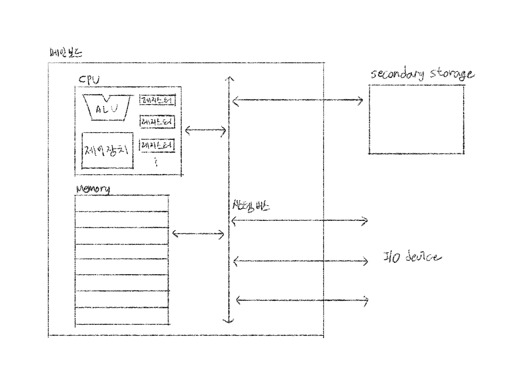

Computer Composition
========
컴퓨터의 구성
-----

**컴퓨터 구조는 왜 이해하여야 하는가?**
>문법만으로는 알기 어려운 ***성능/용량/비용***을 고려하여 개발할 수 있다.

- 컴퓨터 구조
  - 컴퓨터가 이해하는 정보
    - **데이터**
    - **멍령어**
  - 컴퓨터의 네 가지 핵심 부품
    - **CPU** (중앙처리장치, Central Processing Unit)
    - **메모리** (주기억장치, main memory)
    - **보조기억장치** (secondary storage)
    - **입출력장치** (input/output(I/0) device)

### 메모리
현재 실해되는 프로그램의 명령어와 데이터를 저장하는 부품. 즉, 프로그램이 실해되려면 반드시 메모리에 저장되어 있어야 한다.
저장된 명령어와 데이터의 위치는 정돈되어 있어야 한다. 
그래서 메모리에는 저장된 값에 빠르고 효율적으로 접근하기 위해 주소(address)라는 개념이 사용된다.

### CPU
메모리에 저장된 명령어를 읽어 들이고, 읽어 들인 명령어를 해성하고, 실행하는 부품.
- 산술논리연산장치 (ALU; Arithmetic Logic Unit)
- 레지스터 (register)
- 제어장치 (CU; Control Unit)

### 보조기억장치
메모리보다 크기가 크고 전원이 꺼져도 저장된 내용을 잃지 않는 메모리를 보조할 저장 장치.
 _하드 디스크, SSD, USB 메모리, DVD, CD-ROM 등_ 
메모리가 현재 **실행되는** 프로그램을 저장한다면, 보조기억장치는 **보관할** 프로그램을 저장한다.

### 입출력장치
마이크, 스피커, 프린터, 마우스, 키보드처럼 컴퓨터 외부에 연결되어 컴퓨터 내부와 정보를 교환하는 장치.

### 메인보드
여러 컴퓨터 부품을 부착할 수 있는 슬롯과 연결 단자가 있다.

### 시스템 버스
메인보드에 연결된 부품들이 서로 정보를 주고 받는 통로
- 주소 버스
- 데이터 버스
- 제어 버스